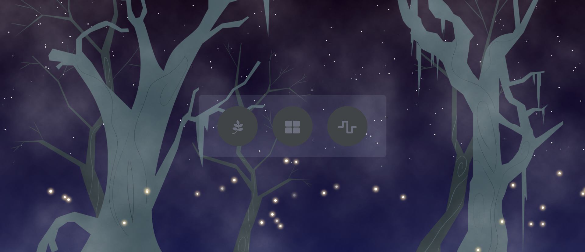

# 迷霧森林小遊戲 

<p>
  受詛咒的森林，籠罩在濃霧與黑暗之中，玩家必須克服三道關卡，才能破解咒語！
</p>
<p>
  Demo：<a  href="https://kjwen310.github.io/vue-games/#/">開始挑戰！</a>
</p>

---

## 使用技術

- 利用 [Vue 3](https://v3.vuejs.org/) 搭配composition API 創建專案
- 利用 [Vuex 4](https://next.vuex.vuejs.org/) 進行狀態管理
- 利用 [Vue Router 4](https://router.vuejs.org/) 處理前端路由
- 利用 [Animate.css](https://animate.style/) 搭配Vue3 transition，實現換頁效果
- 利用 [Lodash](https://lodash.com/) 實作隨機洗牌等功能
- 利用 HTML Canvas 實作貪吃蛇遊戲
- 利用 Sass/scss 撰寫樣式結構，未使用額外框架，並包含響應式設計

---

## 特色介紹

1. 遊戲開始時，可選擇**初級**或**進階**，不同難度將帶來不同的結局
2. 共有**尋找配對**、**完成拼圖**與**貪吃蛇**三道關卡，順序可自由調整，需要在限制條件內完成
3. 完成全部關卡後，可解鎖森林的詛咒

#### 尋找配對

<p>
  牌堆中共有八種花，每種花各有兩張，挑戰記憶力，完成兩兩配對！
</p>
<p>
  
</p>

#### 完成拼圖

<p>
  岩石上刻有散亂的數字，須由左到右、由上到下重新排列。
</p>
<p>
  
</p>

#### 貪吃蛇

<p>
  用上下左右鍵操作小蛇，不可撞到邊界，蒐集七顆黃色寶石即完成！
</p>
<p>
  
</p>

#### 逐步解鎖

<p>
  每完成一道關卡，就能解鎖部分的星空、螢光；完成所有關卡，可解鎖結局。
</p>
<p>
  
</p>

---

## Project setup
```
npm install
```

### Compiles and hot-reloads for development
```
npm run serve
```

### Compiles and minifies for production
```
npm run build
```

### Lints and fixes files
```
npm run lint
```

### Customize configuration
See [Configuration Reference](https://cli.vuejs.org/config/).
